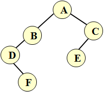

# 线索二叉树

## 线索二叉链表存储结构和相关内容的定义

```c++
typedef int Status;              //声明函数类型名

typedef  char TElemType;    //声明结点元素值得类型

typedef struct BiThrNode {  //定义线索二叉链表的结点结构和类型

      TElemType data;

       struct BiThrNode *lchild, *rchild;

       int  LTag, RTag;

}BiThrNode,*BiThrTree;
```

## 线索二叉树基本操作与应用函数的实现


好的，以下是根据你的需求提取的 Markdown 内容：

### 1. InitBiThrTree(BiThrTree &T)

根据先序遍历的字符序列，创建一棵按线索二叉链表结构存储的尚未线索化的二叉树。在该二叉链表中，若结点有左孩子（即 lchild 非空），则其 LTag=0，否则 LTag=1；若二叉树的结点有右孩子（即 rchild 非空），则其 RTag=0，否则 RTag=1。指针变量 T 指向二叉树的根结点。

### 2. InOrderThreading(BiThrTree &Thrt, BiThrTree T)

对 InitBiThrTree(BiThrTree &T)函数创建的二叉树 T 按中序遍历进行线索化，线索化后的中序线索二叉树带“头结点”，头结点的 data 域存放字符'@'，指针 Thrt 指向该头结点，头结点的左指针指向二叉树的根结点（LTag=0），右指针指向该二叉树中序遍历的最后一个结点（RTag=1）。同时，该二叉树中序遍历第一个结点的左指针指向头结点（LTag=1），中序遍历最后一个结点的右指针也指向头结点（RTag=1）。

线索化过程如下：设 p 指向当前访问的结点，pre 指向 p 的前驱结点，则：

1. 对 p 所指的结点完成前驱线索化，即：p->LTag=1; p->lchild=pre;
2. 对 pre 所指的结点完成后继线索化，即：pre->RTag=1; pre->rchild=p;

建议采用非递归的中序遍历方法实现，pre 的初始值为头结点指针 Thrt，在中序遍历访问结点的位置（printf()），做以下操作：

```c++
if (!p->lchild) {p->LTag=1; p->lchild=pre;}
if (!pre->rchild) {pre->RTag=1; pre->rchild=p;}
pre=p;
```

在遍历结束后，还要对最后一个结点线索化：

```c++
pre->rchild=Thrt; pre->RTag=1;
Thrt->rchild=pre;
```

### 3. InOrderTraverse(BiThrTree T)

按孩子中序遍历线索二叉树（递归），输出每个结点的数据，格式如下：

```
| LTag | 左指针所指元素 | 本结点的值 | 右指针所指元素 | RTag |
```

如：`| 1 | ^ | D | F | 0 |` 或 `| 1 | @ | D | F | 0 |`

### 4. InOrderTraverse_Thr(BiThrTree T)

按线索和孩子中序遍历线索二叉树（非递归），输出每个结点的数据，格式同上。

### 5. 编写一个主函数 main()，检验上述操作函数是否正确，实现以下操作：

1. 调用 InitBiThrTree(T)函数，创建一棵按线索二叉链表结构存储的尚未线索化的二叉树。
2. 调用 InOrderTraverse(T)函数，输出每个结点的数据。
3. 调用 InOrderThreading(Thrt, T)函数，将 T 线索化成一棵中序线索二叉树。
4. 调用 InOrderTraverse(Thrt)函数，输出每个结点的数据。
5. 调用 InOrderTraverse_Thr(Thrt)函数，输出每个结点的数据。
